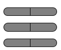

Recently I was working on a side project <a href="http://steveafrost.com">with a friend of mine</a> that required a simple responsive navigation menu and navicon. The hamburger navicon is ubiquitous and remains the undisputed champion in the world of responsive navbar UI's. There is some amazing potentiality in icon animation that range from [https://jonsuh.com/hamburgers/" ](css animations) to [http://codepen.io/Zaku/pen/vcaFr](advanced svg pathway animations).

<h2 style="text-align: center;">All Hail the King!</h2>


I ended up experimenting with a hamburger animation that utilizes styled HTML `<span>` elements, CSS transitions and a small amount of jQuery. Credit to the creator here: <a href="https://codepen.io/designcouch/">codepen profile</a>. This tutorial will go through the code step-by-step.

<h2>The HTML</h2>

First we will create a containing div with six `<span>` elements to style. You can use 3, 4, 8, 10 or as many `<span>` elements as you need to achieve your design and animation goals.

```html
<div id="hamburger">
  <span></span>
  <span></span>
  <span></span>
  <span></span>
  <span></span>
  <span></span>
</div>
```

<h2>The SCSS</h2>

We will give `div#hamburger` enough width and length to allow ourselves a large enough canvas for animation. We use `cursor: pointer;` to indicate that the div can be clicked.

```scss
* {
 margin: 0;
 padding: 0;
}
#hamburger {
 width: 60px;
 height: 45px;
 position: relative;
 margin: 50px auto;
 cursor: pointer;
}
```

We will then give the `<span>` elements general styling and their positions prior to animation:

```scss
span {
 display: block;
 position: absolute;
 height: 9px;
 width: 50%;
 background: grey;
 border: 1px solid black;
 opacity: 1;
 transition: .25s ease-in-out;
 &:nth-child(even) {
  left: 50%;
  border-radius: 0 9px 9px 0;
 }
 &:nth-child(odd) {
  left: 0;
  border-radius: 9px 0 0 9px;
 }
 &:nth-child(1) {
  top: 0;
 }
 &:nth-child(2) {
  top: 0;
 }
 &:nth-child(3) {
  top: 18px;
 }
&:nth-child(4) {
  top: 18px;
 }
 &:nth-child(5) {
  top: 36px;
 }
 &:nth-child(6) {
  top: 36px;
 }
}
```

We will give each `<span>` element a width of 50% of the div, position them side by side and give them vertical positioning. These positions will be the animation starting points.

Each `<span>` will have `transition: .25s ease-in-out;` which specifies a .25s long transition effect with a slow start and end.

Even and odd elements get a different border radius so that the innermost side remains uncurved.

Even though there are 6 elements, they will appear to be three lines in the shape of a hamburger. Using a border we can see what the elements look like with the above styling:



In order for the animation to occur we need to create the 2nd position for all the span elements. We can do this all at once by giving `<div id="hamburger">` a second css class when the user clicks on the div. All the SCSS in total:

```scss
* {
margin: 0;
padding: 0;
}
#hamburger {
 width: 60px;
 height: 45px;
 position: relative;
 margin: 50px auto;
 cursor: pointer;
 span {
 display: block;
 position: absolute;
 height: 9px;
 width: 50%;
 background: grey;
 opacity: 1;
 transition: .25s ease-in-out;
 &:nth-child(even) {
  left: 50%;
  border-radius: 0 9px 9px 0;
 }
 &:nth-child(odd) {
  left: 0;
  border-radius: 9px 0 0 9px;
 }
  &:nth-child(1) {
  top: 0;
 }
  &:nth-child(2) {
  top: 0;
 }
  &:nth-child(3) {
  top: 18px;
 }
  &:nth-child(4) {
  top: 18px;
 }
  &:nth-child(5) {
  top: 36px;
 }
 &:nth-child(6) {
  top: 36px;
 }
}
&.open span {
  &:nth-child(1) {
   transform: rotate(45deg);
   left: 5px;
  top: 7px;
  }
  &:nth-child(6) {
   transform: rotate(45deg);
   left: calc(50% - 5px);
  top: 29px;
  }
  &:nth-child(2) {
   transform: rotate(-45deg);
   left: calc(50% - 5px);
   top: 7px;
  }
  &:nth-child(5) {
  transform: rotate(-45deg);
   left: 5px;
   top: 29px;
  }
  &:nth-child(3) {
   left: -50%;
   opacity: 0;
  }
  &:nth-child(4) {
   left: 100%;
   opacity: 0;
  }
 }
}
```

Once we add the class of `.open` to `div#hamburger` 4 span elements will rotate and shift position into an 'X'. The other two will fade left and right using `opacity: 0`.

We can add a click event to toggle the class with only a few lines of jQuery.

<h2>The Javascript</h2>

```javascript
$(function() {
 $('#hamburger').click(function(){
  $(this).toggleClass('open');
 });
});
```

Make sure that you import [jQuery](https://code.jquery.com/) prior to running the above script. This code will add an event listener that will toggle `.open` on `div#hamburger` every time you click on it. Clicking on the icon now should trigger the animation in both directions.

Here is a [demo](https://codepen.io/jbitar/pen/LybOEE) of the above code in action.
