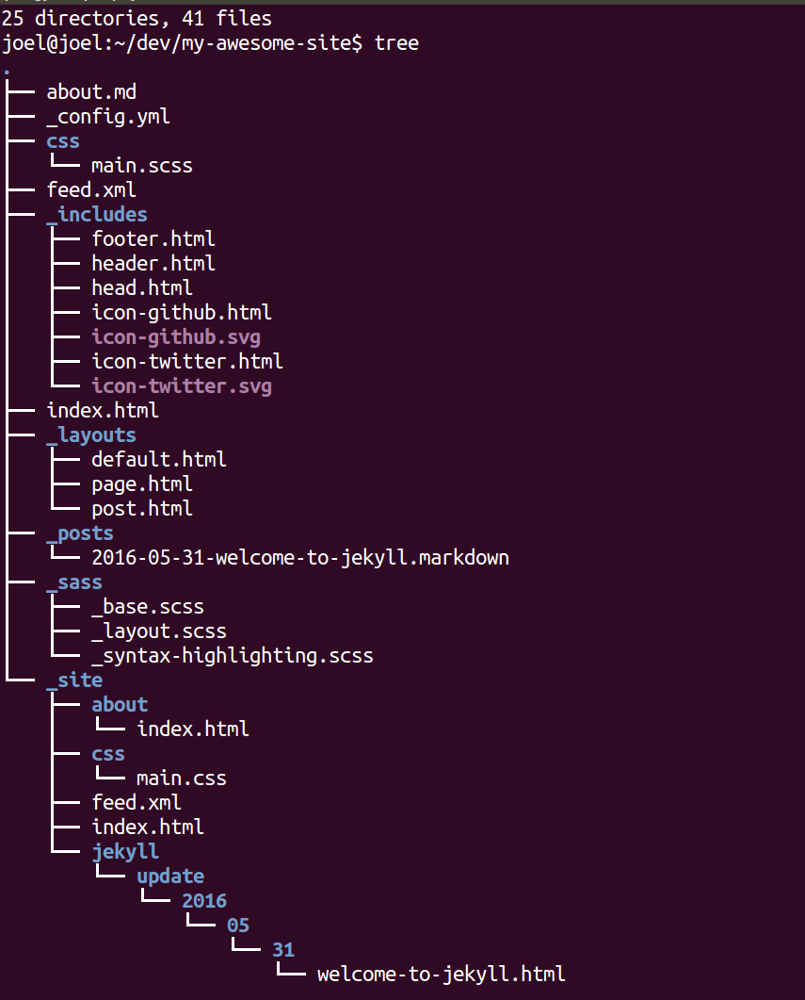

Currently, the most popular platforms for building quick and simple websites are Wordpress and Jekyll. A Jekyll page can be posted on your GitHub account within minutes and has become a new standard in web development. Jekyll is a blog-focused, static-site generator. What is the difference between a static website and a dynamic website? A static website is the simplest type of site that can be built. It is designed for sites that have content that will remain static, or unchanging.

In order for us to customize our Jekyll site we need to understand its file structure and also how it utilizes liquid tags to nest elements. The file structure initially presents some challenges because it's not as simple as editing index.html/style.css files and then immediately seeing your changes upon refreshing. This blog post will be dedicated to breaking down the file structure with the goal of getting “under the hood” in order to utilize all the HTML and CSS we've learned.

###Setting up the Site

Jekyll is built with Ruby and needs it in order to construct the file system of your site. Please make sure you have the latest version of Ruby installed by <a href="https://www.ruby-lang.org/en/">downloading it directly</a>  or via `gem install ruby` using a UNIX command line. You can also install Ruby with RVM [(Ruby Version Manager)](https://rvm.io/): if you need to install and switch between multiple versions of Ruby.

After installing Ruby we need to install [Jekyll](https://jekyllrb.com/) itself. Jekyll is a Ruby gem and we install it via: `jekyll gem install`. Now we are going to make a new directory, the location on your drive doesn't matter. In the terminal type: `jekyll new my-awesome-site` or replace “new-site” with your choice of folder name. Jekyll will create a new folder inside your current working directory with all of the files Jekyll needs to for your site.

For the purposes of this post, I'm going to assume you already use Git and have knowledge of its commands and how to interact with remote repositories. If you don't know what Git is, please go to the Git home page (https://git-scm.com/) to learn what Git is and how to use it.

Initialize a new local Git repository by typing in `git init` inside your new Jekyll directory. Now let's take a look at the page we just created by typing `jekyll serve` in the command line. This will run a watch on the entire server that we can view locally by going to `http://localhost:4000/`

Breakdown of File Tree:

**config.yml:** This file is only meant to be set up once and contains settings for your blog. Here you can  enter your site's title that appears at the top of the browser window. You can also specify what files get included when you serve the site. Every time you edit this file you will need to re-serve Jekyll by running `jekyll serve` in order to see the changes.

**_css:** Jekyll utilizes SASS (a CSS preprocessor) and this folder can either be filled with traditional .css files or .scss files. I currently have one file called main.scss which is importing .sass files from my `_sass` folder.

**_includes:** Here we can create .html files which we can include in any portions of our site. For example, I have a file here called navbar.html. I can then “include” my navbar anywhere using a liquid tag. I've also made head.html an 'include', which allows me to keep my code organized nicely.

**_layouts:** This is where put together our pages. Here I have a default.html file that makes use of my many  “includes”. I've included my head.html and navbar.html here.  If you think of 'includes' as puzzle pieces then the files inside this folder are the puzzles you make with the pieces.I also have a `post.html` file that utilizes my `default.html` and contains that I utilize whenever I create a new post (see below).

**_posts:** Home of your blog posts. The filenames of the blog posts are important and it's necessary to maintain a specific format. The filename for this post is `2016-06-03-Jekyll-file.structure.markdown` and it's important to keep the date and title in this format. Otherwise they won't be properly recognized as blog posts by Jekyll.

**_sass:** This is where your .sass files live. Sass files are then compiled into a .css file in your _site directory when you perform a `jekyll serve`.

**_site:** When you type in `jekyll serve` and temporarily serve your changes to your local host, your file directory is compiled into the _site folder. For this reason, nothing should ever be added or deleted from _site. You will also note that there are no .sass files inside of _site. Rather, all of your .sass files are being compiled into the main.css file.
